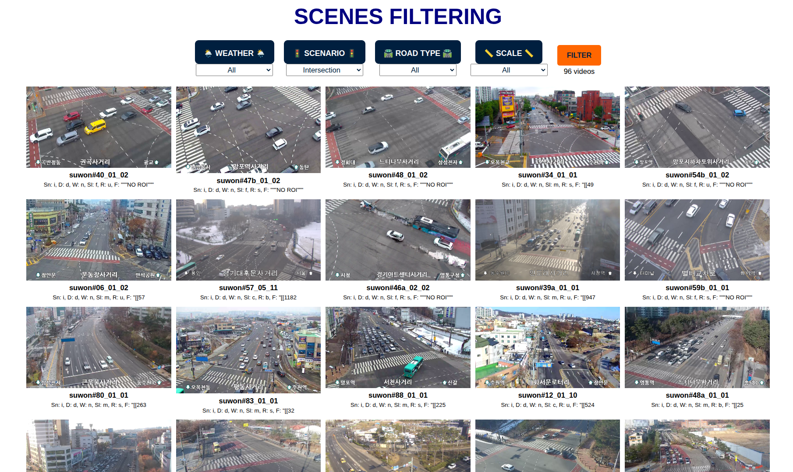

# Filter Scenes in TSBOW

A lightweight web interface for browsing and filtering scene samples from the TSBOW dataset by weather, scenario, road type, and scale.




## Website

The online demo is available at:

https://ngochdm.github.io/TSBOW-Scenes-Public/


## Run Locally

Clone or open this repository, then start a local HTTP server from the project root:

```bash
cd TSBOW-Scenes-Public
python -m http.server 8000  # Start a local HTTP server
```

Open your browser and navigate to:

http://localhost:8000/index.html

A **local HTTP server is recommended** because the page loads `TSBOW_info.csv` using JavaScript.


## Scenes Filtering

The interface supports filtering scenes by the following attributes:

1. Weather: All, Normal, Haze, Rain, Snow

2. Scenario: All, Road, Intersection, Special Cases, Disaster

3. Road Type: All, Urban, Standard, Boulevard

4. Scale: All, Fine, Medium, Coarse

Select the desired attributes and click the `FILTER` button to display matching scenes.


## Dataset Metadata

Scene metadata is stored in `TSBOW_info.csv`.

The CSV file uses the following column order: 

```text
VIDEO_ID, SCENARIO, DAYTIME, WEATHER, SCALE, ROADTYPE, DURATION
```

<!-- `videoID`, `scenario`, `daytime`, `weather`, `scale`, `roadtype`, `duration`. -->

The filtering logic in `js/main.js` expects the same order:

```js
const [videoID, scenario, daytime, weather, scale, roadtype, duration] = row;
```

If the CSV structure changes, update the parsing logic in `js/main.js` accordingly.
